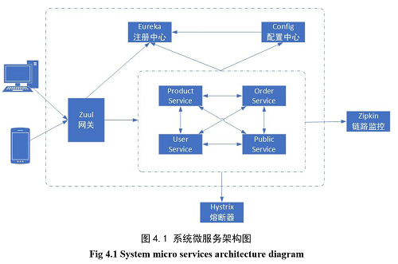

# 小区生鲜团购系统
&emsp;&emsp;2019年本科毕设项目，基于微服务架构，完成团购系统的设计和开发。前端使用**React**作为主要的开发框架，后端开发使用**SpringBoot、SpringCloud**作为开发框架，利用SpringCloud拥有的功能完善的、轻量级的微服务实现组件完成整个系统微服务架构和系统业务的设计与开发工作，同时利用**阿里云OSS**平台存储系统的产品图片和物流提示信息，基于**WebSocket协议**实现浏览器和服务器之间的全双工通信，整个系统被垂直切分为**产品服务、订单服务、用户服务、公共服务共4类服务**。在完成系统开发任务的基础上，利用**Docker**这一轻量级的容器完成微服务的编排和部署工作，系统可以根据实际的服务负载情况，手动调节不同服务节点的个数，以此来满足不同场景下的业务需求。

&emsp;&emsp;分支说明如下：

序号 |分支 |  说明 
-|-|-
01 | [cloud-eureka](https://github.com/just-right/groupbuy/tree/cloud-eureka) | 注册中心-后端 
02 | [cloud-config](https://github.com/just-right/groupbuy/tree/cloud-config) |  配置中心-后端 
03 | [cloud-zuul](https://github.com/just-right/groupbuy/tree/cloud-zuul) |  Zuul网关-后端 
04 | [cloud-orderservice](https://github.com/just-right/groupbuy/tree/cloud-orderservice) | 订单服务-后端  
05 | [cloud-productservice](https://github.com/just-right/groupbuy/tree/cloud-productservice) | 产品服务-后端  
06 | [cloud-publicservice](https://github.com/just-right/groupbuy/tree/cloud-publicservice) | 公共服务-后端  
07 | [cloud-userservice](https://github.com/just-right/groupbuy/tree/cloud-userservice) | 用户服务-后端  
08 | [front-admin](https://github.com/just-right/groupbuy/tree/front-admin) | 管理员管理-前端 
09 | [front-merchant](https://github.com/just-right/groupbuy/tree/front-merchant) | 商家管理-前端 
10 | [front-user](https://github.com/just-right/groupbuy/tree/front-user) | 用户购物-前端 

&emsp;&emsp;系统微服务架构如下：

